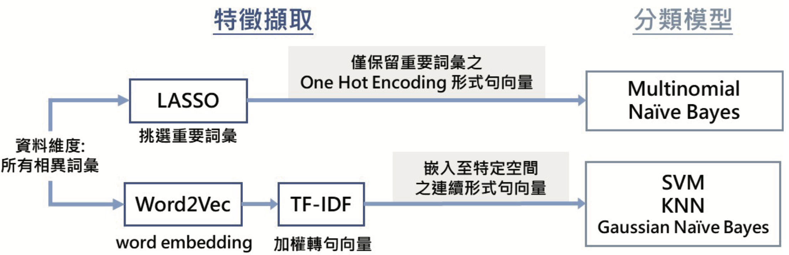

# 你是什麼意思？🤣🙄😠 以分類模型建立表情符號推薦器
- 國立臺北大學統計學系 110 學年度專題報告競賽
- 報告日期：2022 / 06 / 17
- 本項目旨在研究通訊軟體中文字與表情符號的關聯，開發能夠推薦與文字情緒相符的表情符號的系統。
- 內容概要請詳見: `簡介_表情符號推薦器.pdf`

## 摘要
人們使用通訊軟體傳遞文字訊息時，常在語句中加上表情符號。我們對其 中的關聯深感興趣，因而想探討文字背後的情緒意義，並找出最貼近文字情緒 的表情符號，製作表情符號推薦器。   
我們將爬蟲取得的資料整理過後，依使用情境將表情符號分成 40 組作為 分類器的Label，採用兩種特徵擷取方法分別訓練分類模型(如下圖所示)，並 將原始常見的分為一類的做法，改成算出各個表情符號組別的發生機率，提供 多組選擇供使用者做參考。

 

 

## 檔案說明
### 1. 報告
- `簡介_表情符號推薦器.pdf`: 專題目標與實驗流程簡介。
- `書面報告_表情符號推薦器.pdf`: 完整報告書。
- `PPT_表情符號推薦器.pdf`: 報告使用PPT。

### 2. 程式碼
#### (1) 蒐集資料
- `01_FBcrawler_社團_粉專.ipynb`: 爬取 Facebook 社團與粉絲專頁。
- `01_FBcrawler_個人主頁.ipynb`: 爬取 Facebook 個人檔案。
- `01_IGcrawler.ipynb`: 爬取 Instagram 貼文與留言。
- `01_Line_斷句.ipynb`: 將 LINE 的聊天紀錄格式轉為可直接使用的文本。

#### (2) 資料預處理
- `02_raw_nocut.ipynb`：移除文本中的所有表情符號(用於訓練word2vec)。
- `02_clean_final.R`：將文本中的句子切斷，使得一個句子對應一個表情，並只留下有表情符號的句子。
- `02_together_icon2.R`：一次跑取多個檔案。
- `03_斷詞_0330.ipynb`：將文本中的詞彙做分割，並將簡體中文轉換為繁體中文。
- `04_ByeStopwords2.ipynb`：去除文本中的停用詞。
- `05_詞頻_句長統計_0401.ipynb`: 進行詞頻和句長的統計。
- `05_icon_40group_0509.ipynb`: 對特定表情符號進行分組。

#### (3) 特徵擷取 (word2vec)
- `06_W2VTFIDF.ipynb`: 結合 Word2Vec 和 TF-IDF 方法進行詞向量計算。
- `06_w2vtfidf_to_training.ipynb`: 提取句向量和標籤。

#### (4) 分類模型
- `07_Bayes1.ipynb`: 使用貝式分類器進行分類。
- `07_knn_cv.ipynb`: 使用 KNN 進行分類。
- `07_NN_model.ipynb`: 使用類神經網路進行分類。
- `07_svm_cv.ipynb`: 使用 SVM 進行分類。

#### (5) 其餘處理與嘗試
- `08_Tomek.ipynb`: 使用 Tomek Links 進行降採樣。
- `08_AfterTomek_traintest.ipynb`: 基於 Tomek Links 方法進行資料清洗後，將數據切分為訓練集和測試集。
- `08_emo_pca.ipynb`: 使用 PCA 方法降維。
- `08_emoji_sampling.ipynb`: 對句向量進行抽樣處理。
- `08_smote+draw.ipynb`: 針對不平衡數據使用 SMOTE 方法進行過採樣，並進行資料繪圖。
- `08_smote+enn.ipynb`: 結合 SMOTE 方法和 Edited Nearest Neighbors (ENN) 進行平衡處理。
- `08_tSNE.ipynb`、`08_emo_tSNE.R`: 利用 t-SNE 方法對數據進行降維與視覺化。
- `09_合併.ipynb`: 表情符號數量與分佈分析。
- `09_afterpca_split.ipynb`: PCA 後數據集劃分。
- `09_ba_sample.ipynb`: 數據進行平衡處理，以改善模型訓練過程中的類別不平衡問題。
- `09_combine_data.ipynb`: 合併不同來源的資料。
- `09_emo_check.ipynb`: 分析表情符號在高維句向量空間中的位置。
- `09_get20group.ipynb`: 提取出現頻率最高的前 20 組表情符號。
- `09_survey_sampling.ipynb`: 為進行問卷調查抽取樣本。
- `09_train_test_split.ipynb`: 劃分資料集。

## Note
以上為我在學習程式設計初期所寫的程式，因此結構可能不夠完整及標準。若閱讀或使用過程中遇到任何問題，或者有任何改進的建議，歡迎通過以下的電子郵件與我聯繫：[tiffany217.h@gmail.com](mailto:tiffany217.h@gmail.com)。

